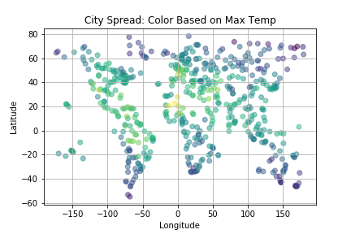
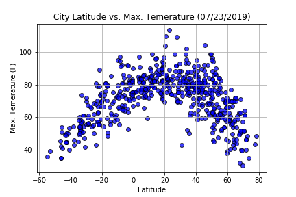
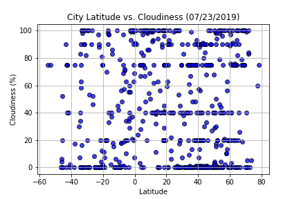
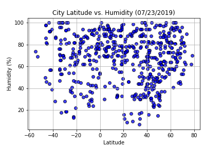
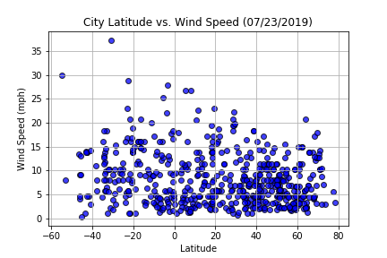

# WeatherAPI

I wanted to determine if lattitude had an impact on the following average weather variables: temperature, cloudiness, humidity, and wind speed. Using citipy and random lattitude-longitude cooridants, data on 500+ randomly selected cities was gathered from openweathermapy. Pandas and matplotlib are used to manipulate data and generate dataframes in addition to producing plots that visually summarize the findings.

In general, the closer one is to the equator the higher the maximum temperate in a given year. Our expectation is the maximum temperature plotted by latitude would follow a concaved parabola. This confirmed in the Latitude vs Temperature plot:

In general, the cloudiness, humidity, and wind speed are not impacted by the lattitude.

